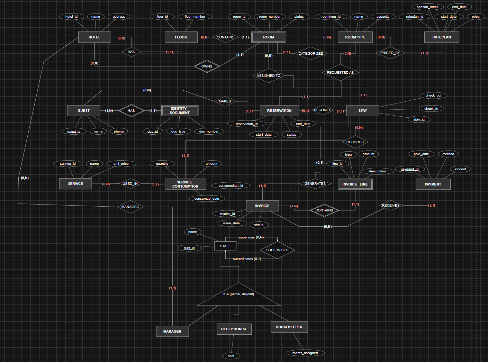
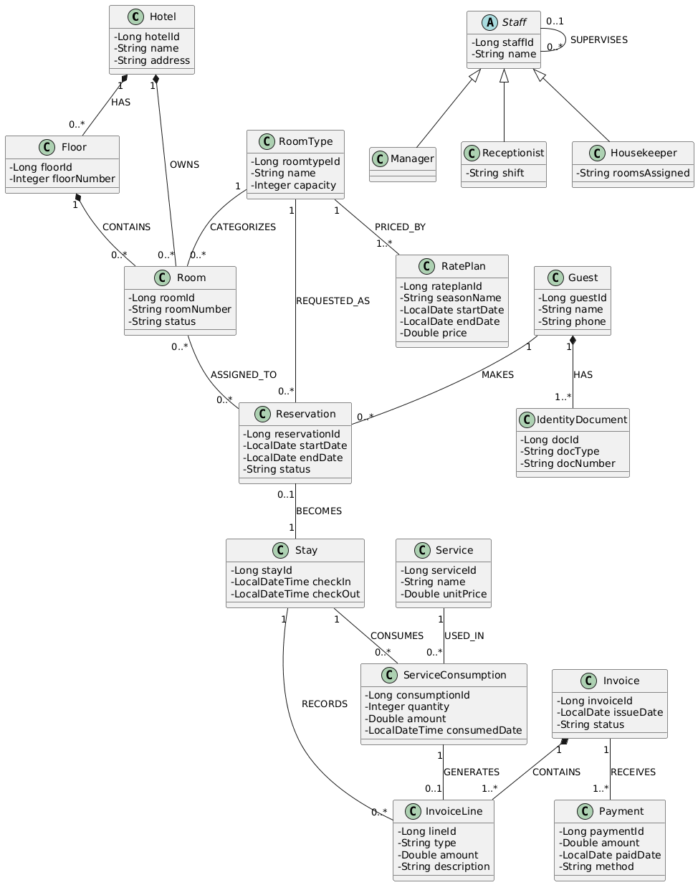

# Hotel Management System

A decoupled Java domain model and relational database architecture for an end-to-end hotel management system.

---

##  Overview

This project provides a structural object-oriented domain model and corresponding relational schema for core hotel operations, including room inventory, guest registration, staff management, booking lifecycle, service tracking, and invoicing.

---

##  System Diagrams

### 1. Entity Relationship Diagram (ERD)


### 2. UML Class Diagram


---

##  Domain Architecture

The core entities are structured into five main subsystems:

- **Hotel Structure**: `Hotel`, `Floor`, `Room`, `RoomType`, `RatePlan`
- **Guest & Identity**: `Guest`, `IdentityDocument`
- **Staff Hierarchy**: `Staff` (Abstract), `Manager`, `Receptionist`, `Housekeeper`
- **Reservation & Stay**: `Reservation`, `Stay`
- **Billing & Services**: `Service`, `ServiceConsumption`, `Invoice`, `InvoiceLine`, `Payment`

---

## 🗄 Relational Database Schema (DDL)

```sql
-- Hotel Structure & Pricing
CREATE TABLE room_type (
    roomtype_id BIGSERIAL PRIMARY KEY,
    name VARCHAR(100) NOT NULL,
    capacity INT NOT NULL
);

CREATE TABLE rate_plan (
    rateplan_id BIGSERIAL PRIMARY KEY,
    roomtype_id BIGINT REFERENCES room_type(roomtype_id),
    season_name VARCHAR(100),
    start_date DATE,
    end_date DATE,
    price DECIMAL(12, 2) NOT NULL
);

CREATE TABLE hotel (
    hotel_id BIGSERIAL PRIMARY KEY,
    name VARCHAR(150) NOT NULL,
    address VARCHAR(255)
);

CREATE TABLE floor (
    floor_id BIGSERIAL PRIMARY KEY,
    hotel_id BIGINT REFERENCES hotel(hotel_id),
    floor_number INT NOT NULL
);

CREATE TABLE room (
    room_id BIGSERIAL PRIMARY KEY,
    hotel_id BIGINT REFERENCES hotel(hotel_id),
    floor_id BIGINT REFERENCES floor(floor_id),
    roomtype_id BIGINT REFERENCES room_type(roomtype_id),
    room_number VARCHAR(20) NOT NULL,
    status VARCHAR(50) DEFAULT 'AVAILABLE'
);

-- Guest & Identity
CREATE TABLE guest (
    guest_id BIGSERIAL PRIMARY KEY,
    name VARCHAR(100) NOT NULL,
    phone VARCHAR(20)
);

CREATE TABLE identity_document (
    doc_id BIGSERIAL PRIMARY KEY,
    guest_id BIGINT REFERENCES guest(guest_id) ON DELETE CASCADE,
    doc_type VARCHAR(50) NOT NULL,
    doc_number VARCHAR(100) NOT NULL
);

-- Staff Management
CREATE TABLE staff (
    staff_id BIGSERIAL PRIMARY KEY,
    supervisor_id BIGINT REFERENCES staff(staff_id),
    name VARCHAR(100) NOT NULL,
    role VARCHAR(50) NOT NULL,
    shift VARCHAR(50),
    rooms_assigned VARCHAR(255)
);

-- Reservations & Stays
CREATE TABLE reservation (
    reservation_id BIGSERIAL PRIMARY KEY,
    guest_id BIGINT REFERENCES guest(guest_id),
    roomtype_id BIGINT REFERENCES room_type(roomtype_id),
    start_date DATE NOT NULL,
    end_date DATE NOT NULL,
    status VARCHAR(50) DEFAULT 'PENDING'
);

CREATE TABLE reservation_room (
    reservation_id BIGINT REFERENCES reservation(reservation_id),
    room_id BIGINT REFERENCES room(room_id),
    PRIMARY KEY (reservation_id, room_id)
);

CREATE TABLE stay (
    stay_id BIGSERIAL PRIMARY KEY,
    reservation_id BIGINT UNIQUE REFERENCES reservation(reservation_id),
    check_in TIMESTAMP NOT NULL,
    check_out TIMESTAMP
);

-- Services & Billing
CREATE TABLE service (
    service_id BIGSERIAL PRIMARY KEY,
    name VARCHAR(100) NOT NULL,
    unit_price DECIMAL(12, 2) NOT NULL
);

CREATE TABLE service_consumption (
    consumption_id BIGSERIAL PRIMARY KEY,
    stay_id BIGINT REFERENCES stay(stay_id),
    service_id BIGINT REFERENCES service(service_id),
    quantity INT NOT NULL,
    amount DECIMAL(12, 2) NOT NULL,
    consumed_date TIMESTAMP NOT NULL
);

CREATE TABLE invoice (
    invoice_id BIGSERIAL PRIMARY KEY,
    issue_date DATE NOT NULL,
    status VARCHAR(50) DEFAULT 'UNPAID'
);

CREATE TABLE invoice_line (
    line_id BIGSERIAL PRIMARY KEY,
    invoice_id BIGINT REFERENCES invoice(invoice_id),
    stay_id BIGINT REFERENCES stay(stay_id),
    consumption_id BIGINT REFERENCES service_consumption(consumption_id),
    type VARCHAR(50) NOT NULL,
    amount DECIMAL(12, 2) NOT NULL,
    description VARCHAR(255)
);

CREATE TABLE payment (
    payment_id BIGSERIAL PRIMARY KEY,
    invoice_id BIGINT REFERENCES invoice(invoice_id),
    amount DECIMAL(12, 2) NOT NULL,
    paid_date DATE NOT NULL,
    method VARCHAR(50) NOT NULL
);
